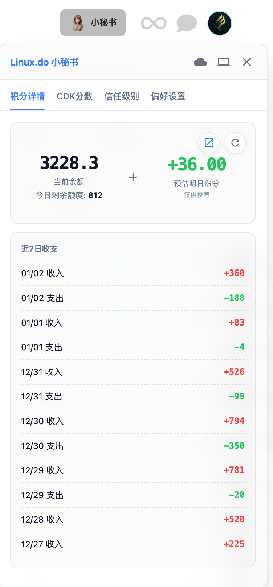
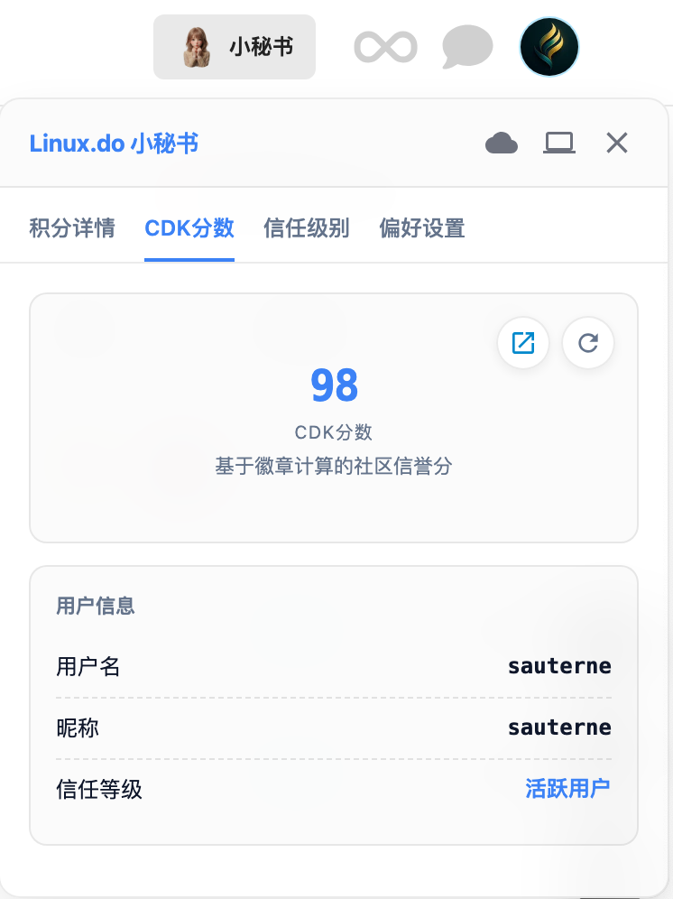
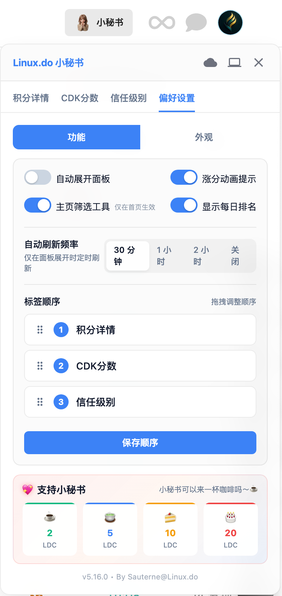
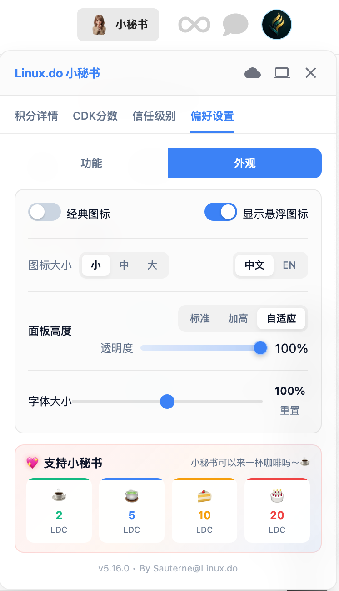
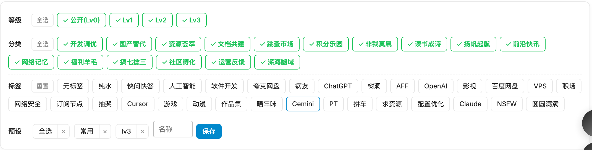

# Linux.do 小秘书 (Linux.do Assistant)

> 🎯 一个简洁优雅的 Linux.do 仪表盘，让你随时掌握信任级别进度、积分动态、CDK 社区分数和主页筛选工具

在浏览 Linux.do 时，是不是经常想知道自己距离下一信任等级还差多少？或者今天的积分还剩多少额度？CDK 社区分数又是多少？想快速筛选出高质量帖子？

**Linux.do 小秘书** 帮你解决这个问题——一个集成在顶栏的小助手，实时显示你的信任级别进度、积分余额、CDK 社区分数，内置主页筛选工具，支持数据变化追踪，再也不用频繁切换页面了。

---

## 📖 目录

- [✨ 功能特点](#-功能特点)
- [📸 截图预览](#-截图预览)
- [📦 安装方法](#-安装方法)
- [🚀 使用说明](#-使用说明)
- [🎛️ 功能详解](#️-功能详解)
- [⚙️ 偏好设置详解](#️-偏好设置详解)
- [❓ 常见问题](#-常见问题)
- [🔧 技术原理](#-技术原理)
- [🔄 自动更新](#-自动更新)
- [⚠️ 注意事项](#️-注意事项)
- [📚 相关文档](#-相关文档)
- [🙏 致谢](#-致谢)
- [📝 更新日志](#-更新日志)

---

## ✨ 功能特点

### 核心功能
- **信任级别监控** - 一目了然的进度条，清晰展示各项指标完成情况
- **支持全等级用户** - 0-4 级全等级适配，低等级用户也能查看升级进度
- **排名积分展示** - 今日排名、今日积分一览无余
- **数据变化追踪** - 自动记录并显示数据涨跌，看清每一点进步
- **积分详情查看** - 余额、每日额度、近7日收支，一个面板搞定
- **预估明日涨分** - 实时显示预估明日涨分，鼠标悬停查看当前分和基准值
- **涨分动画提示** - 涨分时显示醒目的绿色动画效果（可在设置中关闭）
- **CDK 社区分数** - 显示基于徽章计算的社区信誉分，快速查看用户信息
- **主页筛选工具** - 按等级/分类/标签筛选帖子，支持预设保存和拖拽排序

### 智能体验
- **智能数据缓存** - 跨标签页数据持久化，秒显缓存后台刷新，丝滑无感知
- **账号隔离保护** - 自动识别账号切换，避免数据混淆
- **智能降级机制** - Connect 不可用时自动切换 Summary 数据源，并提示用户
- **友好错误提示** - 网络异常时提供清晰的提示和重试选项
- **数据来源标签** - 清晰标注当前数据来源（Connect / Summary）

### 个性化定制
- **小秘书图标** - 全新小秘书形象，hover 时自动切换表情，支持顶栏按钮和悬浮球两种模式
- **经典图标模式** - 可在设置中切换回原版地球图标
- **标签拖拽排序** - 可自由拖拽调整标签页顺序，个性化你的面板布局
- **多主题支持** - 亮色 / 深色 / 跟随系统，总有一款适合你
- **中英双语** - 界面语言随心切换
- **透明度调节** - 自定义面板透明度，不遮挡阅读
- **字体大小调节** - 支持 70%-130% 字体缩放，一键恢复默认
- **可拖动面板** - 悬浮模式下可拖动到喜欢的位置
- **自动刷新设置** - 可选 30分钟 / 1小时 / 2小时 / 关闭
- **设置页分类** - 设置页拆分为"功能"和"外观"双标签页，更清晰

### 其他特性
- **记忆功能** - 自动保存位置和偏好设置
- **自动更新** - 支持 Tampermonkey 自动检测更新，面板内弹窗提示
- **支持作者** - 内置便捷支持入口，感谢您的支持 ❤️

## 📸 截图预览

### 入口图标

| 顶栏按钮模式（默认） | 悬浮图标模式 |
|:---:|:---:|
|  |  |

> 默认显示为顶栏按钮，可在「偏好设置 → 外观」中开启悬浮图标模式

### 功能页面

| 信任级别 | 积分详情 | CDK分数 |
|:---:|:---:|:---:|
|  |  |  |

**信任级别**：显示当前等级（Lv.0-4）、今日排名、积分、注册天数；全部达标时显示庆祝界面，点击「详情」可展开查看各项指标完成情况

**积分详情**：显示 Credit 当前余额、今日剩余额度、预估明日涨分，以及近 7 日收支明细

**CDK分数**：显示基于徽章计算的社区信誉分，以及用户名、昵称、信任等级等用户信息

### 偏好设置

| 功能设置 | 外观设置 |
|:---:|:---:|
|  |  |

**功能设置**：自动展开面板、涨分动画、主页筛选工具、显示每日排名、自动刷新频率、标签页排序等

**外观设置**：显示模式（顶栏/悬浮）、图标样式与大小、界面语言、面板高度、透明度、字体大小等

### 主页筛选工具

  

在 linux.do 首页按条件筛选帖子：
- **等级筛选**：按用户信任等级（公开/Lv1/Lv2/Lv3）筛选
- **分类筛选**：按帖子分类（开发调优、资源荟萃、跳蚤市场等）筛选
- **标签筛选**：按帖子标签（人工智能、ChatGPT、Cursor 等）筛选
- **预设管理**：保存常用筛选组合，一键切换

> 注：CDK 社区分数功能需要先访问 [cdk.linux.do](https://cdk.linux.do/dashboard) 完成 OAuth 授权

## 📦 安装方法

### 前提条件

安装脚本前，你需要先安装一个用户脚本管理器扩展。推荐使用**Tampermonkey**：

**Tampermonkey**
- [Chrome 版](https://chrome.google.com/webstore/detail/tampermonkey/dhdgffkkebhmkfjojejmpbldmpobfkfo)
- [Firefox 版](https://addons.mozilla.org/en-US/firefox/addon/tampermonkey/)
- [Edge 版](https://microsoftedge.microsoft.com/addons/detail/tampermonkey/iikmkjmpaadaobahmlepeloendndfphd)
- [Safari 版](https://apps.apple.com/app/apple-store/id1482490089)

### 方法一：从 GreasyFork 安装（推荐）

1. 安装好 Tampermonkey 后，访问脚本页面：
   - **[GreasyFork - Linux.do Assistant](https://greasyfork.org/zh-CN/scripts/560271-linux-do-assistant)**
2. 点击「安装此脚本」
3. 在 Tampermonkey 弹出的确认页点击「安装」
4. 完成！访问 [linux.do](https://linux.do) 即可看到顶栏「小秘书」按钮

### 方法二：从 GitHub 安装

1. 确保已安装 Tampermonkey
2. 点击下方链接直接安装：
   - **[安装 Linux.do Assistant](https://github.com/dongshuyan/Linuxdo-Assistant/raw/main/Linuxdo-Assistant.user.js)**
3. Tampermonkey 会自动识别并弹出安装页
4. 点击「安装」即可

### 方法三：手动安装

1. 点击 Tampermonkey 图标 → 「添加新脚本」
2. 删除编辑器中的默认代码
3. 复制 [Linuxdo-Assistant.user.js](https://github.com/dongshuyan/Linuxdo-Assistant/blob/main/Linuxdo-Assistant.user.js) 的全部内容粘贴进去
4. 按 `Ctrl+S` 或点击「文件 → 保存」

## 🚀 使用说明

安装后访问 [linux.do](https://linux.do)，顶栏会出现「小秘书」按钮（如上图 [icon1.png](#入口图标)）。

### 基本操作

| 操作 | 说明 |
|---|---|
| **点击顶栏按钮/悬浮球** | 展开仪表盘面板 |
| **悬停悬浮球** | 小秘书会切换表情（闭眼） |
| **长按顶栏按钮/悬浮球** | 在帖子页面快速返回第 1 楼 |
| **拖动悬浮球/标题栏** | 移动面板位置 |

### 面板功能

| 操作 | 说明 |
|---|---|
| **切换标签页** | 积分详情 / CDK分数 / 信任级别 / 偏好设置（顺序可自定义） |
| **点击主题图标** | 切换亮色 ☀️ / 深色 🌙 / 跟随系统 |
| **点击刷新按钮** | 手动刷新当前页数据 |
| **点击外链图标** | 跳转到对应数据源页面 |
| **点击云朵图标** | 手动检查是否有新版本 |

### 偏好设置

| 操作 | 说明 |
|---|---|
| **功能标签页** | 开关各项功能、设置自动刷新频率、拖拽调整标签顺序 |
| **外观标签页** | 切换显示模式、调整图标大小、语言、透明度、字体大小等 |
| **拖拽排序标签** | 在功能设置中拖动标签项调整顺序，点击「保存顺序」生效 |

### 主页筛选

| 操作 | 说明 |
|---|---|
| **等级/分类/标签筛选** | 勾选所需条件，帖子列表自动筛选 |
| **保存预设** | 输入名称点击「保存」，将当前筛选条件保存为预设 |
| **切换预设** | 点击已保存的预设标签快速切换筛选条件 |
| **删除预设** | 点击预设旁的 × 删除 |

## 🎛️ 功能详解

### 信任级别监控

显示当前信任等级（Lv.0-4）的升级进度和各项指标完成情况：

- **头部信息**：当前等级、达标状态、数据来源（Connect/Summary）
- **快捷数据**：今日排名、今日积分、注册天数
- **达标状态**：✅ 绿色已达标 / ❌ 红色未达标
- **全部达标**：所有指标满足时显示庆祝界面，点击「详情」展开具体指标

| 用户等级 | 显示指标 |
|---|---|
| **Lv.0 - Lv.1** | 浏览话题、已读帖子、阅读时间、访问天数、送出赞、获赞、帖子数量 |
| **Lv.2+** | 访问天数、浏览话题、已读帖子、送出赞、获赞、被举报次数、被禁言次数等 |

### 积分详情

展示 Credit 积分系统相关信息：

| 指标 | 说明 |
|---|---|
| **当前余额** | 你的 Credit 积分余额（左侧大字显示） |
| **今日剩余额度** | 每日可用的积分额度 |
| **预估明日涨分** | 基于 gamification_score 计算的预估涨分（绿色显示） |
| **近7日收支** | 按日期展示收入（绿色 +）和支出（红色 -）明细 |

### CDK 社区分数

显示基于 cdk.linux.do 徽章计算的社区信誉分：

| 信息项 | 说明 |
|---|---|
| **CDK分数** | 社区信誉分数值（居中大字显示） |
| **用户名** | 你的 Linux.do 用户名 |
| **昵称** | 你的显示昵称 |
| **信任等级** | 当前信任等级描述（如「活跃用户」） |

> 首次使用需访问 [cdk.linux.do/dashboard](https://cdk.linux.do/dashboard) 完成 OAuth 授权

### 主页筛选工具

在 linux.do 首页按多维度条件筛选帖子，仅在首页生效：

| 筛选维度 | 说明 |
|---|---|
| **等级** | 按发帖用户等级筛选（公开/Lv1/Lv2/Lv3），支持全选 |
| **分类** | 按帖子分类筛选（开发调优、资源荟萃、跳蚤市场等） |
| **标签** | 按帖子标签筛选（人工智能、ChatGPT、Cursor、游戏等） |
| **预设** | 保存/加载常用筛选组合，输入名称点击「保存」创建预设 |

### 长按快速返回

在帖子详情页面，**长按顶栏按钮或悬浮球**可快速滚动到帖子第 1 楼，方便阅读长帖子时快速回顶。

## ⚙️ 偏好设置详解

设置页分为「功能」和「外观」两个标签页（如下图所示）：

### 功能设置

| 设置项 | 说明 | 默认值 |
|---|---|---|
| **自动展开面板** | 进入页面时自动展开仪表盘面板 | 关闭 |
| **涨分动画提示** | 积分涨分时显示绿色 +X.X 动画效果 | 开启 |
| **主页筛选工具** | 在 linux.do 首页显示筛选工具栏（仅首页生效） | 开启 |
| **显示每日排名** | 在信任级别页显示今日排名和积分 | 开启 |
| **自动刷新频率** | 后台自动刷新数据间隔：30分钟 / 1小时 / 2小时 / 关闭 | 30分钟 |
| **标签顺序** | 拖拽调整标签页显示顺序，点击「保存顺序」生效 | - |

### 外观设置

| 设置项 | 说明 | 默认值 |
|---|---|---|
| **经典图标** | 启用后悬浮球恢复为原版蓝色地球图标 | 关闭 |
| **显示悬浮图标** | 启用后使用悬浮球模式，关闭则使用顶栏按钮模式 | 关闭 |
| **图标大小** | 小秘书图标尺寸：小 / 中 / 大 | 小 |
| **界面语言** | 中文 / EN（English） | 中文 |
| **面板高度** | 标准 / 加高 / 自适应 | 自适应 |
| **透明度** | 调节面板整体透明度（滑块 0-100%） | 100% |
| **字体大小** | 70%-130% 可调，点击「重置」恢复默认 | 100% |

### 支持小秘书

设置页底部提供便捷的支持入口，可选择 2/5/10/20 LDC 打赏支持作者 ❤️

> 💡 **提示**：
> - 使用前请确保已登录 linux.do 账号
> - 拖拽标签项可自定义面板布局，保存后生效
> - 关闭「显示每日排名」可减少 API 请求，降低触发频率限制风险

## 🔧 技术原理

### 数据获取策略

脚本采用**智能分级**数据获取策略：

| 用户等级 | 主数据源 | 降级方案 |
|---|---|---|
| Lv.0 - Lv.1 | Summary API + 硬编码升级要求 | - |
| Lv.2+ | Connect.linux.do | Summary API (部分指标) |

### 登录状态判定

使用 `/session/current.json` API 进行权威登录判定，确保准确识别用户登录状态。

### CDK 数据获取

支持两种获取方式：
1. **直接请求** - 优先通过 GM_xmlhttpRequest 直接获取
2. **Bridge 模式** - 通过隐藏 iframe 桥接 cdk.linux.do 获取（兼容 Tampermonkey）

### 数据缓存

- 所有数据使用 GM_setValue/GM_getValue 持久化存储
- 支持跨标签页共享缓存
- 自动检测账号切换并清理缓存
- 可配置自动刷新频率

### 请求频率限制

脚本内置多层频率限制机制，防止请求过于频繁：

| 限制层级 | 限制内容 | 作用范围 |
|---|---|---|
| 自动刷新间隔 | 默认 30 分钟 | 当前标签页 |
| 全局冷却 | 5 秒 | 当前标签页 |
| 排行榜独立冷却 | 60 秒 | 跨标签页共享 |
| 请求频率硬限制 | 每分钟 3 次/分组 | 跨标签页共享 |
| 429 限流锁 | 服务器返回的冷却时间 | 跨标签页共享 |

> 📚 详细的 API 接口调用和频率限制分析请参阅：[API 频率限制文档](docs/api-rate-limits.md)

## ❓ 常见问题

### 🔴 脚本图标不显示

**现象**：在 篡改猴 (Tampermonkey) / ScriptCat 中已安装脚本，但在 linux.do 页面中未显示任何内容。

**修复方法**：

1. 打开浏览器的【管理扩展】页面；

2. 开启右上角的【开发者模式】；

3. 进入 篡改猴/ScriptCat 的详细信息页，确保**允许运行用户脚本**（或相关权限）已开启。

### 🟠 信任级别显示被降级

**现象**：信任级别页面数据很少，或显示为降级状态。

**原因**：未能成功获取 Connect 页面内容。

**尝试方法**：
1. 访问一下 [Connect 页面](https://connect.linux.do)，再返回原页面刷新。
2. 访问 Connect 页面并退出账号，然后返回原页面刷新并重新登录。

### 🟡 提示"授权校验异常，已继续显示缓存数据"

**原因**：之前成功获取过数据，但当前授权可能已过期或失效。

**解决方法**：请访问一下对应的数据源页面（如 [connect.linux.do](https://connect.linux.do)、[credit.linux.do](https://credit.linux.do)、[cdk.linux.do](https://cdk.linux.do)），检查授权状态。确认无误后，返回页面刷新即可。

## 🔄 自动更新

脚本支持自动更新功能：

- **自动检测**：Tampermonkey 会定期检查 GitHub 上的最新版本
- **手动检查**：点击标题栏的更新图标
- **智能提示**：发现新版本后，面板内弹窗提示，可选择立即更新或暂不更新
- **静默跳过**：选择"暂不更新"后，1小时内不再自动提醒

## ⚠️ 注意事项

- 脚本需要登录 linux.do 后才能正常获取数据
- 信任级别数据来自 connect.linux.do（Lv.2+）或 summary API（Lv.0-1）
- 排名/积分数据来自 linux.do 主站 leaderboard API
- Credit 数据来自 credit.linux.do，首次使用需完成 OAuth 授权
- CDK 社区分数来自 cdk.linux.do，首次使用需访问 [cdk.linux.do/dashboard](https://cdk.linux.do/dashboard) 完成 OAuth 授权
- 若使用 Tampermonkey，请允许脚本在 cdk.linux.do 域运行；授权后切回 linux.do 若仍为空，打开 cdk.linux.do/dashboard 刷新一次再回到主站
- 数据会在浏览器本地缓存，跨标签页共享；切换账号时会自动清理缓存避免数据混淆
- 如果数据加载失败，请检查网络连接或尝试刷新

## 📚 相关文档

- [API 接口调用与频率限制分析](docs/api-rate-limits.md) - 详细分析脚本调用的所有 API 接口及其频率限制机制

## 🙏 致谢

本脚本的开发参考了以下项目和资源，在此表示感谢：

- [LinuxDoStatus](https://github.com/1e0n/LinuxDoStatus) - 信任级别显示脚本，提供了实现思路参考
- [LINUX DO Credit 悬浮窗脚本](https://linux.do/t/topic/1356074) - Credit 积分悬浮窗实现参考
- [LINUX DO Credit 积分显示和预测脚本](https://linux.do/t/topic/1365853) - Credit 积分预测方案参考
- [L站分数与排名显示脚本](https://linux.do/t/topic/918083) - 分数与排名显示方案参考
- [Linux.do 顶部显示脚本](https://linux.do/t/topic/1357173) - 排名/积分数据获取方案参考
- [Linux.do 筛选工具](https://linux.do/t/topic/1285285) ([GitHub](https://github.com/chadyi/LinuxdoSieve)) - 主页筛选工具实现参考
- AI 辅助工具 - 协助完成部分代码编写

## 📝 更新日志

### v5.16.0
- 🔧 **默认值调整** - 「显示每日排名」设置默认改为开启

### v5.15.0
- 📚 **文档完善** - 新增 API 接口调用与频率限制分析文档
- 📖 **README 更新** - 增加完整功能说明、设置详解、docs 文档链接

### v5.14.0
- 🐛 **内存泄漏修复** - 修复内存泄漏问题，MutationObserver 添加防抖机制
- ⚡ **筛选优化** - 筛选工具添加变化检测，减少不必要的 DOM 操作

### v5.13.0
- 👆 **长按返回1楼** - 在帖子页面长按悬浮球/顶栏按钮快速返回第1楼
- 🔧 **默认值调整** - 自动展开面板默认关闭

### v5.12.0
- 🐛 **筛选修复** - 修复筛选工具无限刷新问题
- ➕ **加载更多** - 新增加载更多按钮

### v5.10.0
- 🚦 **频率限制** - 修复请求过于频繁问题，增加防抖和冷却机制
- 🛡️ **防重复** - 防止 iframe 多实例

### v5.8.0
- 🎨 **设置页双标签** - 设置页拆分为"功能"和"外观"双标签页，减少页面长度
- 🔤 **字体大小调节** - 新增字体大小滑块（70%-130%），支持一键恢复默认
- 📌 **支持区域固定** - 支持小秘书区域始终可见，不再被大量设置项挤到底部

### v5.7.0
- 🔍 **主页筛选工具** - 新增主页筛选工具，按等级/分类/标签筛选帖子，支持预设保存和拖拽排序

### v5.6.0
- 💬 **支持小秘书** - 设置页"支持作者"改为"支持小秘书"，文案改为随机语录

### v5.5.0
- 🦊 **Firefox 兼容** - 修复 Firefox 数据获取问题
- 🔝 **顶栏按钮模式** - 新增顶栏按钮模式支持
- 📅 **注册天数显示** - 修复注册天数显示问题

### v5.4.0
- 🐛 **位置修复** - 修复悬浮球展开面板后位置偏移问题

### v5.3.0
- 🦊 **Firefox 跨域修复** - 修复 Firefox + Tampermonkey 跨域 cookie 问题（withCredentials）

### v5.1.1
- 🛡️ **图标加载容错** - 网络问题导致图片下载失败时，自动回退显示经典地球图标，刷新页面后重试

### v5.1.0
- 🖼️ **高清图标升级** - 小秘书图片升级为 512x512 高清版，在高分屏上显示更清晰

### v5.0.0
- 🎀 **全新小秘书形象** - 悬浮球升级为可爱的小秘书形象，hover 时自动切换表情
- 📐 **图标尺寸设置** - 支持小(58px) / 中(88px) / 大(128px) 三种尺寸选择
- 🔵 **经典图标模式** - 新增"经典图标"开关，可随时切换回原版地球图标
- 💾 **图标本地缓存** - 小秘书图片首次加载后自动缓存到本地，后续无需重复下载
- 📖 **设置说明完善** - README 新增偏好设置详解表格

### v4.6.0
- 📱 **移动端标签排序** - 设置页面标签排序现已支持移动端长按拖拽，解决触摸屏滑动与拖拽冲突问题

### v4.5.0
- 📱 **移动端拖动支持** - 悬浮球和面板标题栏现已支持移动端触摸拖动，手机浏览器体验与桌面端一致

### v4.4.0
- 📈 **预估明日涨分** - 积分详情页面新增「预估明日涨分」显示，左右结构展示当前余额与预估涨分
- ✨ **涨分动画提示** - 当预估涨分增加≥1时，悬浮球/面板会显示绿色 +X.X 动画效果
- 🎛️ **动画开关设置** - 偏好设置中新增「涨分动画提示」开关，可自由开启或关闭
- 💡 **即时 Tooltip** - 鼠标悬停预估涨分区域立即显示当前分和基准值，无延迟

### v4.3.0
- ☁️ **检查更新图标优化** - 将检查更新按钮从刷新箭头改为云朵图标，避免与刷新数据按钮混淆
- ✨ **检查更新交互增强** - 点击时显示"检查中..."提示并有脉冲动画效果，1秒后淡出

### v4.2.0
- 📱 **移动端适配优化** - 面板宽度支持响应式自适应（300px-370px），小屏设备不再溢出；移动端自适应高度限制为 65vh，改善手机端体验

### v4.1.0
- 🐛 **修复全部达标判定** - 修复 Lv.2+ 用户"全部达标"判定逻辑，现在必须所有指标都达标才会触发庆祝界面（之前只要有一个达标就会错误触发）

### v4.0.0
- 🎊 **全部达标庆祝** - 所有指标达标时显示精美庆祝动画界面，支持详情/收起切换
- 🔄 **智能账号监测** - 每 5 秒检测账号切换/退出，实时更新缓存与 UI，支持多设备/多账号切换
- 🔐 **多重登录判断** - Session + Connect + DOM 三重兜底，6 种用户名获取方式确保稳定
- 💾 **缓存版本控制** - 自动清理旧版本残留缓存，结构校验避免脏数据
- 🛡️ **授权异常保护** - 偶发 401/403 时保留缓存数据继续展示，避免界面闪烁
- 📊 **升级要求完善** - Lv.1 升级新增「帖子数量」指标

### v3.0.0
- 🎯 **全等级支持** - 新增 Lv.0-1 级用户信任等级显示，使用 Summary + 硬编码升级要求
- 🔐 **权威登录判定** - 使用 session/current.json API 确保准确识别登录状态
- 🔄 **智能降级机制** - Lv.2+ 用户 Connect 不可用时自动切换 Summary 数据源
- 📊 **数据来源标签** - 清晰显示当前数据来源（Connect / Summary）
- 💬 **友好错误提示** - 网络异常时提供清晰的提示和操作按钮
- ⚡ **刷新按钮动画** - 刷新时按钮旋转，提供更好的交互反馈
- 🐛 修复多项细节问题

### v2.0.0
- 🚀 脚本加载自动检查更新，发现新版本在面板内弹窗提示
- 🕐 "暂不更新"后1小时内不再自动提醒，手动按钮仍可随时检查
- 🪟 更新提示改为面板内弹窗，不再占据页面底部

### v1.8.0
- ⚡ 智能数据缓存：跨标签页数据持久化，秒显缓存后台刷新
- 🔄 并行取数优化：脚本加载即并行预热三页数据，按设置间隔后台刷新
- 🔒 账号隔离保护：自动识别账号切换，防止不同账号数据混淆
- 🗑️ 新增清除缓存：偏好设置中可一键清空本地缓存数据
- 🕐 页面级慢速提示：请求超5s时友好提示，不再干等
- 🛠️ 重试策略优化：401/403错误不再无意义重试，网络错误最多重试2次

### v1.7.0
- 🎨 面板标题更名为「Linux.do 小秘书」
- 📐 优化设置页面布局，增加面板宽度，减少文字换行
- 💖 支持作者区域移至设置底部，更加整洁

### v1.6.1
- 修复若干 bug

## 📄 许可证

MIT License

## 🔗 相关链接

- **GitHub**: [https://github.com/dongshuyan/Linuxdo-Assistant](https://github.com/dongshuyan/Linuxdo-Assistant)
- **GreasyFork**: [https://greasyfork.org/zh-CN/scripts/560271-linux-do-assistant](https://greasyfork.org/zh-CN/scripts/560271-linux-do-assistant)
- **问题反馈**: [GitHub Issues](https://github.com/dongshuyan/Linuxdo-Assistant/issues)

---

  Made with ❤️ for Linux.do Community

