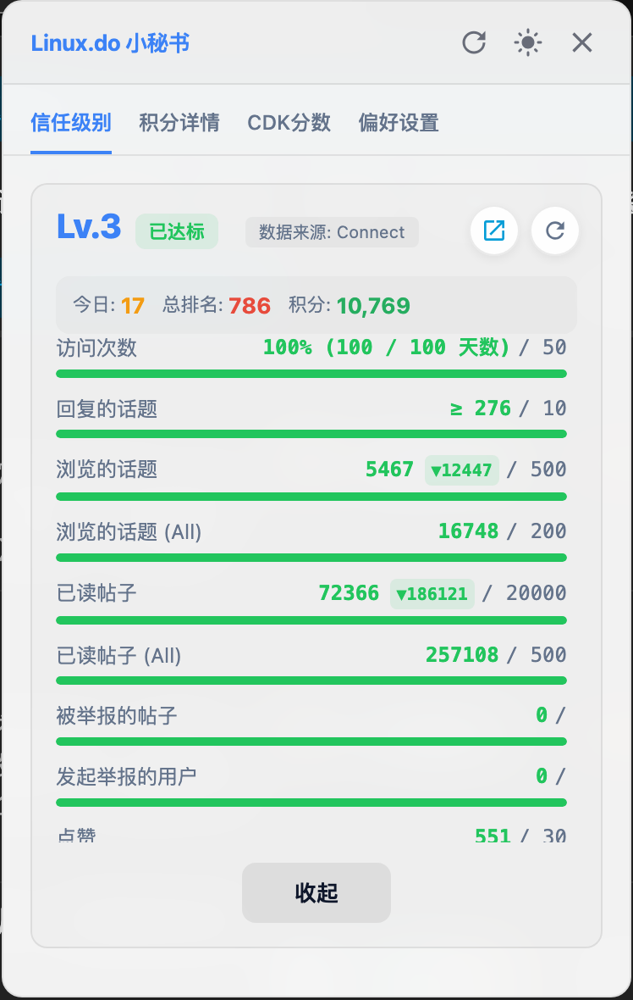
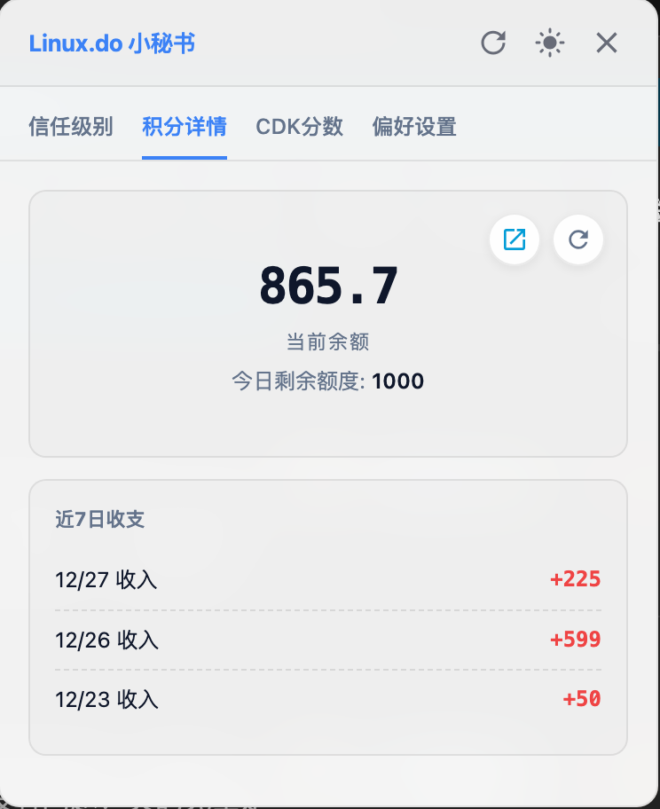
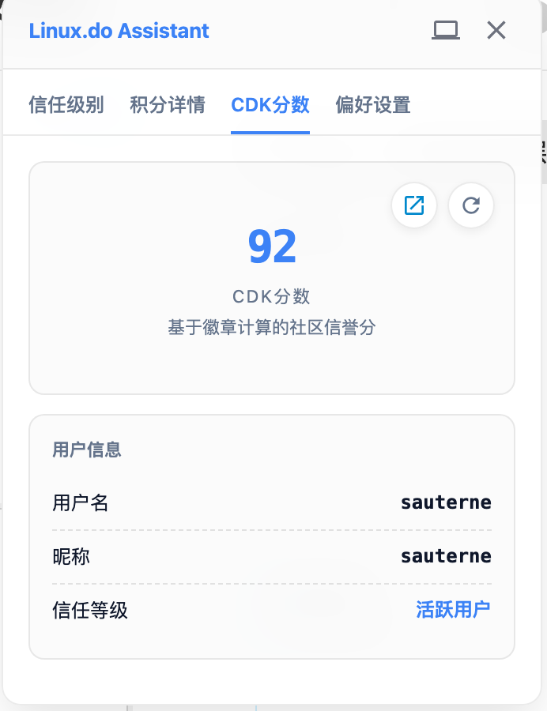
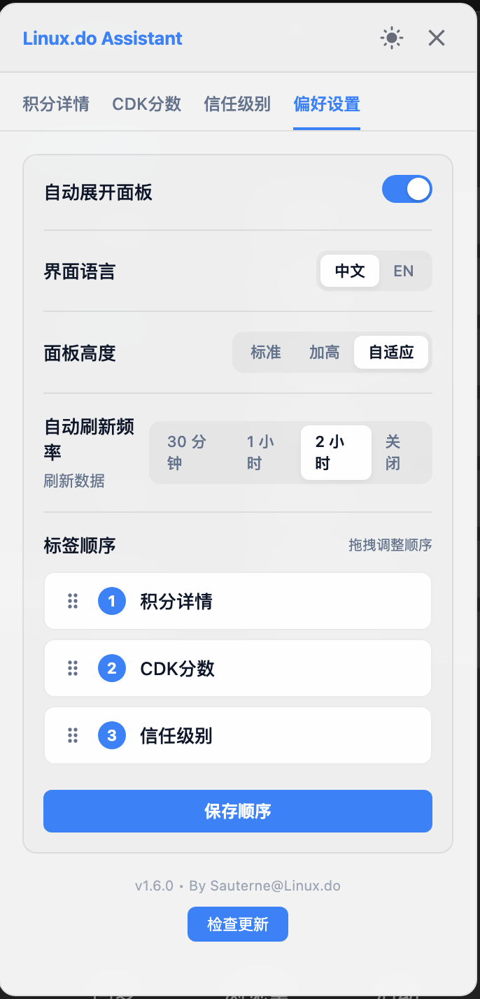
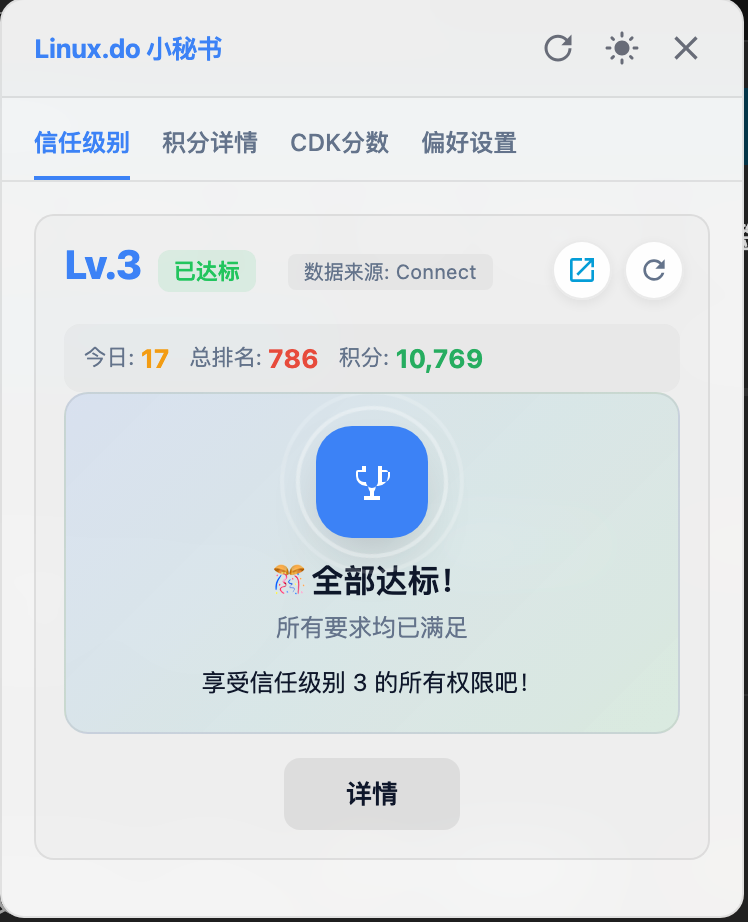

# Linux.do 小秘书 (Linux.do Assistant)

> 🎯 一个简洁优雅的 Linux.do 仪表盘，让你随时掌握信任级别进度、积分动态和 CDK 社区分数

在浏览 Linux.do 时，是不是经常想知道自己距离下一信任等级还差多少？或者今天的积分还剩多少额度？CDK 社区分数又是多少？

**Linux.do 小秘书** 帮你解决这个问题——一个悬浮在页面角落的小助手，实时显示你的信任级别进度、积分余额、CDK 社区分数，支持数据变化追踪，再也不用频繁切换页面了。

## ✨ 功能特点

### 核心功能
- **信任级别监控** - 一目了然的进度条，清晰展示各项指标完成情况
- **支持全等级用户** - 0-4 级全等级适配，低等级用户也能查看升级进度
- **排名积分展示** - 今日排名、总排名、积分一览无余
- **数据变化追踪** - 自动记录并显示数据涨跌，看清每一点进步
- **积分详情查看** - 余额、每日额度、近7日收支，一个面板搞定
- **CDK 社区分数** - 显示基于徽章计算的社区信誉分，快速查看用户信息

### 智能体验
- **智能数据缓存** - 跨标签页数据持久化，秒显缓存后台刷新，丝滑无感知
- **账号隔离保护** - 自动识别账号切换，避免数据混淆
- **智能降级机制** - Connect 不可用时自动切换 Summary 数据源，并提示用户
- **友好错误提示** - 网络异常时提供清晰的提示和重试选项
- **数据来源标签** - 清晰标注当前数据来源（Connect / Summary）

### 个性化定制
- **标签拖拽排序** - 可自由拖拽调整标签页顺序，个性化你的面板布局
- **多主题支持** - 亮色 / 深色 / 跟随系统，总有一款适合你
- **中英双语** - 界面语言随心切换
- **透明度调节** - 自定义面板透明度，不遮挡阅读
- **可拖动面板** - 放在你喜欢的位置
- **自动刷新设置** - 可选 30分钟 / 1小时 / 2小时 / 关闭

### 其他特性
- **记忆功能** - 自动保存位置和偏好设置
- **自动更新** - 支持 Tampermonkey 自动检测更新，面板内弹窗提示
- **支持作者** - 内置便捷支持入口，感谢您的支持 ❤️

## 📸 截图预览

### 悬浮球效果

  

### 功能页面

| 信任级别 | 积分详情 | CDK分数 | 偏好设置 |
|:---:|:---:|:---:|:---:|
|  |  |  |  |

### 全部达标效果

  

> 当信任级别所有指标都达标时，会显示庆祝界面，点击「详情」可查看具体指标

> 注：CDK 社区分数功能需要先访问 [cdk.linux.do](https://cdk.linux.do/dashboard) 完成 OAuth 授权

## 📦 安装方法

### 前提条件

安装脚本前，你需要先安装一个用户脚本管理器扩展。推荐使用**Tampermonkey**：

**Tampermonkey**
- [Chrome 版](https://chrome.google.com/webstore/detail/tampermonkey/dhdgffkkebhmkfjojejmpbldmpobfkfo)
- [Firefox 版](https://addons.mozilla.org/en-US/firefox/addon/tampermonkey/)
- [Edge 版](https://microsoftedge.microsoft.com/addons/detail/tampermonkey/iikmkjmpaadaobahmlepeloendndfphd)
- [Safari 版](https://apps.apple.com/app/apple-store/id1482490089)

### 方法一：从 GreasyFork 安装（推荐）

1. 安装好 Tampermonkey 后，访问脚本页面：
   - **[GreasyFork - Linux.do Assistant](https://greasyfork.org/zh-CN/scripts/560271-linux-do-assistant)**
2. 点击「安装此脚本」
3. 在 Tampermonkey 弹出的确认页点击「安装」
4. 完成！访问 [linux.do](https://linux.do) 即可看到悬浮球

### 方法二：从 GitHub 安装

1. 确保已安装 Tampermonkey
2. 点击下方链接直接安装：
   - **[安装 Linux.do Assistant](https://github.com/dongshuyan/Linuxdo-Assistant/raw/main/Linuxdo-Assistant.user.js)**
3. Tampermonkey 会自动识别并弹出安装页
4. 点击「安装」即可

### 方法三：手动安装

1. 点击 Tampermonkey 图标 → 「添加新脚本」
2. 删除编辑器中的默认代码
3. 复制 [Linuxdo-Assistant.user.js](https://github.com/dongshuyan/Linuxdo-Assistant/blob/main/Linuxdo-Assistant.user.js) 的全部内容粘贴进去
4. 按 `Ctrl+S` 或点击「文件 → 保存」

## 🚀 使用说明

安装后访问 [linux.do](https://linux.do)，页面右侧会出现一个蓝色悬浮球。

| 操作 | 说明 |
|---|---|
| **点击悬浮球** | 展开仪表盘面板 |
| **拖动悬浮球/标题栏** | 移动面板位置 |
| **切换标签页** | 信任级别 / 积分详情 / CDK 社区分数 / 偏好设置 |
| **点击主题图标** | 切换亮色/深色/跟随系统 |
| **点击刷新按钮** | 手动刷新数据 |
| **偏好设置** | 可调整语言、面板高度、透明度、自动刷新频率等 |
| **拖拽排序标签** | 在偏好设置中，拖动标签项调整显示顺序，点击保存生效 |
| **检查更新** | 在标题栏点击更新图标，手动检查是否有新版本 |

> 💡 **提示**：
> - 使用前请确保已登录 linux.do 账号
> - 在偏好设置中可以自由拖拽标签顺序，打造专属你的面板布局

## 🔧 技术原理

### 数据获取策略

脚本采用**智能分级**数据获取策略：

| 用户等级 | 主数据源 | 降级方案 |
|---|---|---|
| Lv.0 - Lv.1 | Summary API + 硬编码升级要求 | - |
| Lv.2+ | Connect.linux.do | Summary API (部分指标) |

### 登录状态判定

使用 `/session/current.json` API 进行权威登录判定，确保准确识别用户登录状态。

### CDK 数据获取

支持两种获取方式：
1. **直接请求** - 优先通过 GM_xmlhttpRequest 直接获取
2. **Bridge 模式** - 通过隐藏 iframe 桥接 cdk.linux.do 获取（兼容 Tampermonkey）

### 数据缓存

- 所有数据使用 GM_setValue/GM_getValue 持久化存储
- 支持跨标签页共享缓存
- 自动检测账号切换并清理缓存
- 可配置自动刷新频率

## 🔄 自动更新

脚本支持自动更新功能：

- **自动检测**：Tampermonkey 会定期检查 GitHub 上的最新版本
- **手动检查**：点击标题栏的更新图标
- **智能提示**：发现新版本后，面板内弹窗提示，可选择立即更新或暂不更新
- **静默跳过**：选择"暂不更新"后，1小时内不再自动提醒

## ⚠️ 注意事项

- 脚本需要登录 linux.do 后才能正常获取数据
- 信任级别数据来自 connect.linux.do（Lv.2+）或 summary API（Lv.0-1）
- 排名/积分数据来自 linux.do 主站 leaderboard API
- Credit 数据来自 credit.linux.do，首次使用需完成 OAuth 授权
- CDK 社区分数来自 cdk.linux.do，首次使用需访问 [cdk.linux.do/dashboard](https://cdk.linux.do/dashboard) 完成 OAuth 授权
- 若使用 Tampermonkey，请允许脚本在 cdk.linux.do 域运行；授权后切回 linux.do 若仍为空，打开 cdk.linux.do/dashboard 刷新一次再回到主站
- 数据会在浏览器本地缓存，跨标签页共享；切换账号时会自动清理缓存避免数据混淆
- 如果数据加载失败，请检查网络连接或尝试刷新

## 🙏 致谢

本脚本的开发参考了以下项目和资源，在此表示感谢：

- [LinuxDoStatus](https://github.com/1e0n/LinuxDoStatus) - 信任级别显示脚本，提供了实现思路参考
- [Linux.do 社区讨论](https://linux.do/t/topic/1356074) - 社区成员的需求反馈和建议
- [Linux.do 顶部显示脚本](https://linux.do/t/topic/1357173) - 排名/积分数据获取方案参考
- AI 辅助工具 - 协助完成部分代码编写

## 📝 更新日志

### v4.3.0
- ☁️ **检查更新图标优化** - 将检查更新按钮从刷新箭头改为云朵图标，避免与刷新数据按钮混淆
- ✨ **检查更新交互增强** - 点击时显示"检查中..."提示并有脉冲动画效果，1秒后淡出

### v4.2.0
- 📱 **移动端适配优化** - 面板宽度支持响应式自适应（300px-370px），小屏设备不再溢出；移动端自适应高度限制为 65vh，改善手机端体验

### v4.1.0
- 🐛 **修复全部达标判定** - 修复 Lv.2+ 用户"全部达标"判定逻辑，现在必须所有指标都达标才会触发庆祝界面（之前只要有一个达标就会错误触发）

### v4.0.0
- 🎊 **全部达标庆祝** - 所有指标达标时显示精美庆祝动画界面，支持详情/收起切换
- 🔄 **智能账号监测** - 每 5 秒检测账号切换/退出，实时更新缓存与 UI，支持多设备/多账号切换
- 🔐 **多重登录判断** - Session + Connect + DOM 三重兜底，6 种用户名获取方式确保稳定
- 💾 **缓存版本控制** - 自动清理旧版本残留缓存，结构校验避免脏数据
- 🛡️ **授权异常保护** - 偶发 401/403 时保留缓存数据继续展示，避免界面闪烁
- 📊 **升级要求完善** - Lv.1 升级新增「帖子数量」指标

### v3.0.0
- 🎯 **全等级支持** - 新增 Lv.0-1 级用户信任等级显示，使用 Summary + 硬编码升级要求
- 🔐 **权威登录判定** - 使用 session/current.json API 确保准确识别登录状态
- 🔄 **智能降级机制** - Lv.2+ 用户 Connect 不可用时自动切换 Summary 数据源
- 📊 **数据来源标签** - 清晰显示当前数据来源（Connect / Summary）
- 💬 **友好错误提示** - 网络异常时提供清晰的提示和操作按钮
- ⚡ **刷新按钮动画** - 刷新时按钮旋转，提供更好的交互反馈
- 🐛 修复多项细节问题

### v2.0.0
- 🚀 脚本加载自动检查更新，发现新版本在面板内弹窗提示
- 🕐 "暂不更新"后1小时内不再自动提醒，手动按钮仍可随时检查
- 🪟 更新提示改为面板内弹窗，不再占据页面底部

### v1.8.0
- ⚡ 智能数据缓存：跨标签页数据持久化，秒显缓存后台刷新
- 🔄 并行取数优化：脚本加载即并行预热三页数据，按设置间隔后台刷新
- 🔒 账号隔离保护：自动识别账号切换，防止不同账号数据混淆
- 🗑️ 新增清除缓存：偏好设置中可一键清空本地缓存数据
- 🕐 页面级慢速提示：请求超5s时友好提示，不再干等
- 🛠️ 重试策略优化：401/403错误不再无意义重试，网络错误最多重试2次

### v1.7.0
- 🎨 面板标题更名为「Linux.do 小秘书」
- 📐 优化设置页面布局，增加面板宽度，减少文字换行
- 💖 支持作者区域移至设置底部，更加整洁

### v1.6.1
- 修复若干 bug

## 📄 许可证

MIT License

## 🔗 相关链接

- **GitHub**: [https://github.com/dongshuyan/Linuxdo-Assistant](https://github.com/dongshuyan/Linuxdo-Assistant)
- **GreasyFork**: [https://greasyfork.org/zh-CN/scripts/560271-linux-do-assistant](https://greasyfork.org/zh-CN/scripts/560271-linux-do-assistant)
- **问题反馈**: [GitHub Issues](https://github.com/dongshuyan/Linuxdo-Assistant/issues)

---

  Made with ❤️ for Linux.do Community

